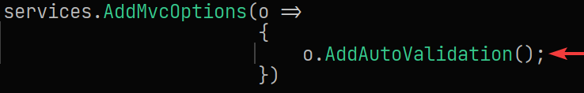
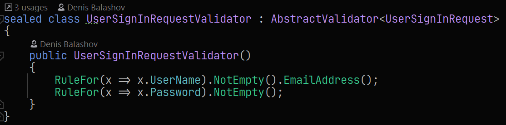
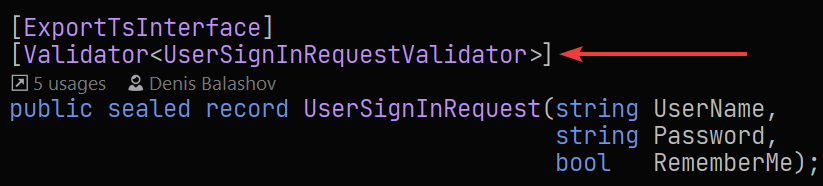
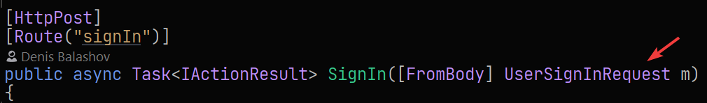

# Usage

### Add packages
* FluentValidation
* FluentValidation.Auto

### Add configuration in Startup class

### Add validator as usual for model

### Add attribute `Validator` for model

### Thats all

All your models in controllers will automatically validated BEFORE action executed

If model invalid - exception will raised and action will no executed